# Fifa 21 (Game) Data @EaSports


## Acknowledgement
Data has been scraped from the publicly available [website](https://sofifa.com/)

## About
FIFA 21 is an association football simulation video game published by Electronic Arts as part of the FIFA series.[1] It is the 28th installment in the FIFA series, and was released on 9 October 2020 for Microsoft Windows, Nintendo Switch, PlayStation 4 and Xbox One. Enhanced versions for the PlayStation 5 and Xbox Series X and Series S were released on 3 December 2020, in addition to a version for Stadia in March 2021.

## About the data
Data includes lastest edition FIFA 2021 players attributes like Age, Nationality, Overall, Potential, Club, Value, Wage, Preferred Foot, International Reputation, Weak Foot, Skill Moves, Work Rate, Position, Jersey Number, Joined, Loaned From, Contract Valid Until, Height, Weight, LS, ST, RS, LW, LF, CF, RF, RW, LAM, CAM, RAM, LM, LCM, CM, RCM, RM, LWB, LDM, CDM, RDM, RWB, LB, LCB, CB, RCB, RB, Crossing, Finishing, Heading, Accuracy, ShortPassing, Volleys, Dribbling, Curve, FKAccuracy, LongPassing, BallControl, Acceleration, SprintSpeed, Agility, Reactions, Balance, ShotPower, Jumping, Stamina, Strength, LongShots, Aggression, Interceptions, Positioning, Vision, Penalties, Composure, Marking, StandingTackle, SlidingTackle, GKDiving, GKHandling, GKKicking, GKPositioning, GKReflexes, and Release Clause.


## Code And Workings

### Imports


```r
library("dplyr")
library("tidyverse")
library("plotly")
library("maps")
library("ggcorrplot")
library("infer")
```

### Data Loading, Cleaning and Data Preparation
<details>
  <summary>Click to expand!</summary>
  
  ```r
  f21 <- read.csv("players_21.csv")

  f21 <- read.csv("players_21.csv", na.strings = c("", "NA"))
  f21[,2]
  f21 <- f21[,-2]
  f21 <- f21[,c(-22,-23)]
  f21 <- f21[,-23]
  f21 <- f21[,-25]
  f21 <- f21[,-41]
  f21 <- f21 %>% select(-gk_diving,-gk_handling,-gk_kicking,-gk_reflexes,-gk_speed,-gk_positioning)
  f21 <- f21 %>% select(-defending_marking)
  f21 <- f21 %>% select(-sofifa_id)

  f21 <- f21 %>% rename(Crossing=attacking_crossing        , Finishing=attacking_finishing ,      
                  HeadingAccuracy=attacking_heading_accuracy, ShortPassing=attacking_short_passing  ,  Volleys=attacking_volleys  ,       
                  Dribbling=skill_dribbling         ,   Curve=skill_curve     ,           FkAccuracy=skill_fk_accuracy    ,     
                  LongPassing=skill_long_passing    ,     Ball_Control=skill_ball_control     ,    Acceleration=movement_acceleration   ,  
                  SprintSpeed=movement_sprint_speed   ,   Agility=movement_agility    ,       Reactions=movement_reactions    ,    
                  Balance=movement_balance    ,       ShotPower=power_shot_power    ,       Jumping=power_jumping   ,          
                  Stamina=power_stamina   ,           Strength=power_strength   ,          LongShot=power_long_shots    ,      
                  Aggression=mentality_aggression   ,    Interception=mentality_interceptions   , Positioning=mentality_positioning   ,  
                  Vision=mentality_vision   ,        Penalty=mentality_penalties    ,    Composure=mentality_composure    ,   
                  StandingTackle=defending_standing_tackle  ,    SlidingTackle=defending_sliding_tackle   ,   GK_Diving=goalkeeping_diving    ,    
                  GK_Handling=goalkeeping_handling   ,    GK_Kicking=goalkeeping_kicking    ,    GK_Positioning=goalkeeping_positioning   ,
                  GK_Reflexes=goalkeeping_reflexes)

  ```
  </details>

#### Nationality wise some selection
<details>
  <summary>Click to expand!</summary>
  
  ```r
  France <- subset(f21,f21$nationality=="France")
  India <- subset(f21,f21$nationality=="India")
  Argentina <- subset(f21,f21$nationality=="Argentina")
  Portugal <- subset(f21,f21$nationality=="Portugal")
  Brazil <- subset(f21,f21$nationality=="Brazil")
  Spain <- subset(f21,f21$nationality=="Spain")
  Germany <- subset(f21,f21$nationality=="Germany")
  ```
</details>
  
#### Club wise some selection
<details>
  <summary>Click to expand!</summary>
  
  ```r
  Barcelona <- subset(f21,f21$club_name=="FC Barcelona")
  BMunich <- subset(f21,f21$club_name=="FC Bayern M?nchen")
  Juventus <- subset(f21,f21$club_name=="Juventus")
  ```
</details>

#### League wise some selection
<details>
  <summary>Click to expand!</summary>
 
  ```r
  La_Liga <- subset(f21,f21$league_name=="Spain Primera Division")
  Serie_A <- subset(f21,f21$league_name=="Italian Serie A")
  Bundesliga <- subset(f21,f21$league_name=="German 1. Bundesliga")
  Ligue_1 <- subset(f21,f21$league_name=="French Ligue 1")
  EPL <- subset(f21,f21$league_name=="English Premier League")
  ```
</details>
  
### Distribution and the Average Age of The Players in each League
<details>
  <summary>Click to expand!</summary>
 
  ```r
  summ <- df %>% 
    group_by(league_name) %>% 
    summarise(Age = mean(age))


  options(repr.plot.width = 12, repr.plot.height = 8)

  ggplot()+
    geom_histogram(df, mapping = aes(age, fill = league_name))+
    geom_vline(summ, mapping = aes(xintercept = Age), color = "red", size = 1.5)+
    geom_text(summ, mapping = aes(x = Age+3, y = 65, label = round(Age,digits = 2)))+
    facet_wrap(league_name~.)+
    theme_minimal()+
    theme(legend.position = "bottom")+
    labs(y = "Frequency", title = "Distribution & The Average Age of The Players in each League", 
         caption = "@EA Sports - FIFA 21")
  ```
</details>

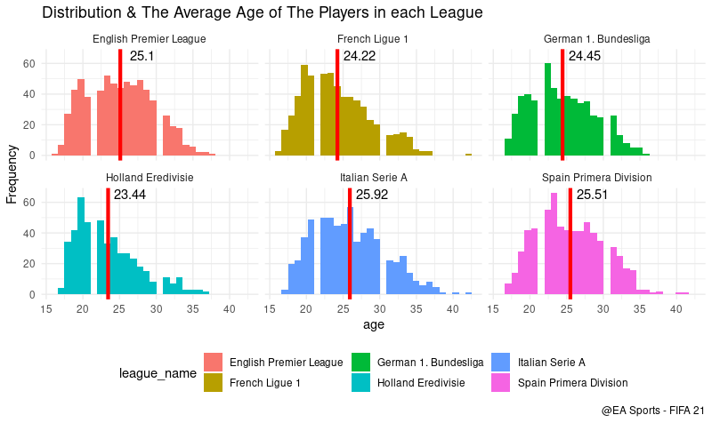

### World map and Players available in Fifa 21 Game
<details>
  <summary>Click to expand!</summary>
 
```r
options(repr.plot.width = 12, repr.plot.height = 8)

world_map <- map_data("world")

numofplayers <- world_map %>% 
  mutate(region = as.character(region)) %>% 
  left_join((f21 %>% mutate(nationality = as.character(nationality),
                           nationality = if_else(nationality %in% "England", 
                                                 "UK", nationality)) %>%
               count(nationality, name = "Number of Player") %>%
               rename(region = nationality) %>%
               mutate(region = as.character(region))), by = "region")


ggplot(numofplayers, aes(long, lat, group = group))+
  geom_polygon(aes(fill = factor(`Number of Player`) ), color = "grey", show.legend = F)+
  scale_fill_viridis_d(option = "D")+
  theme_void()+
  labs(fill = "Number of Player",
       title = "Players enlisted from countries")
```
</details>
  
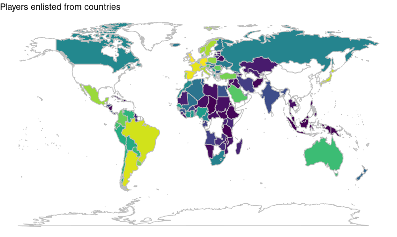

### Players from Barcelona(As Was in Fifa21)
<details>
  <summary>Click to expand!</summary>
 
  ```r
  options(repr.plot.width = 12, repr.plot.height = 8)

  Barcelona %>% 
    select(short_name, overall, potential) %>% 
    arrange(-overall) %>% 
    head(15) %>% 
    gather(variable, Exp, -short_name) %>% 
    ggplot(aes(short_name, Exp, fill = variable))+
    geom_col(position = "dodge")+
    geom_text(aes(label = Exp),position = position_dodge(width = 0.9), vjust = -0.5)+
    scale_fill_manual(values = c("#004D98", "#A50044"))+
    theme_minimal()+
    theme(legend.position = "bottom")+
    labs(fill = NULL, x = NULL, title = "Barcelona")+
    theme(axis.text.x = element_text(face="bold",angle = 90, vjust = 0.5, hjust=1))

  ```
  </details>
  
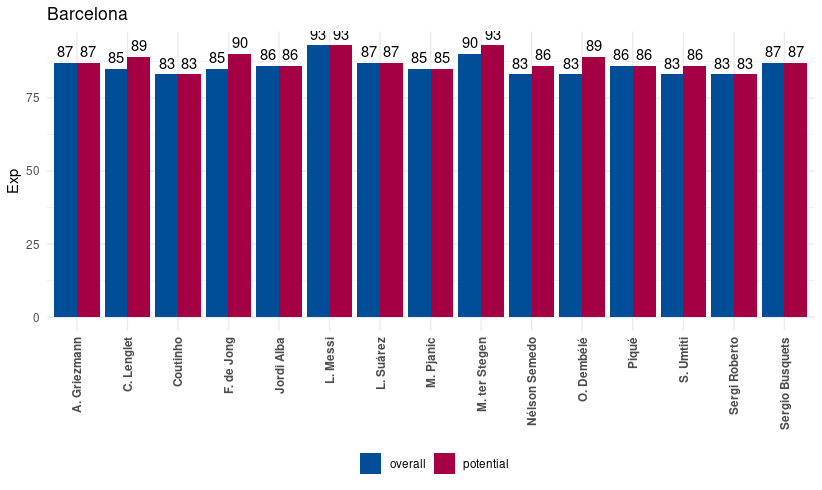

### Players from Brazil
<details>
  <summary>Click to expand!</summary>
  
```r
options(repr.plot.width = 12, repr.plot.height = 8)

Brazil %>% 
  select(short_name, overall, potential) %>% 
  arrange(-overall) %>% 
  head(15) %>% 
  gather(variable, Exp, -short_name) %>% 
  ggplot(aes(short_name, Exp, fill = variable))+
  geom_col(position = "dodge")+
  geom_text(aes(label = Exp),position = position_dodge(width = 0.9), vjust = -0.5)+
  scale_fill_manual(values = c("#009c3b", "#ffdf00"))+
  theme_minimal()+
  theme(legend.position = "bottom")+
  labs(fill = NULL, x = NULL, title = "Brazil")+
  theme(axis.text.x = element_text(face="bold",angle = 90, vjust = 0.5, hjust=1))

```
</details>
  
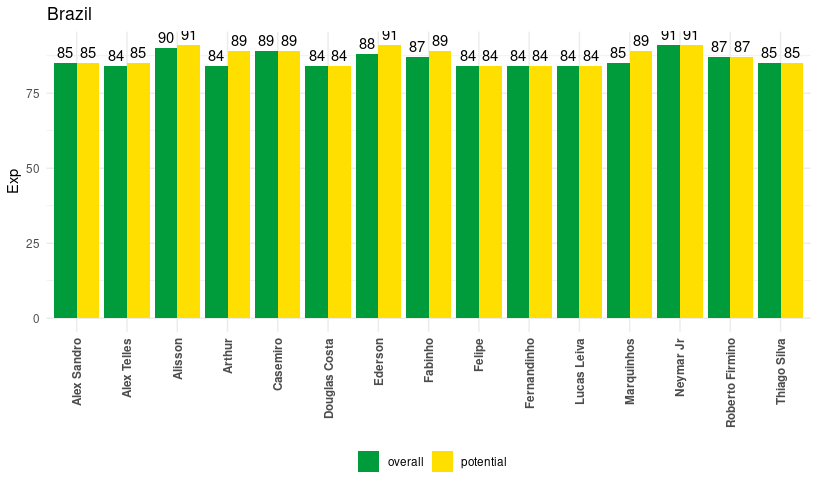

### Messi Vs Ronaldo (Before the transfer of Messi)
<details>
  <summary>Click to expand!</summary>
  
```r
options(repr.plot.width = 15,repr.plot.height = 8)


ggplot(player,aes(Skill,Exp,fill=Name))+ geom_col(position = "fill")+
  coord_flip()+ scale_fill_manual(limits=c("L. Messi,FC Barcelona","Cristiano Ronaldo,Juventus"),values = c("#ff0000","#75AADB"))+theme_minimal()+
  geom_hline(yintercept = 0.5,color="yellow",size=0.5,linetype=2)+
  theme(legend.position = "top",axis.text.y = element_text(face = "bold"),axis.text.x = element_blank())+
  labs(title = "Ronaldo vs Messi")
 
```
</details>
  
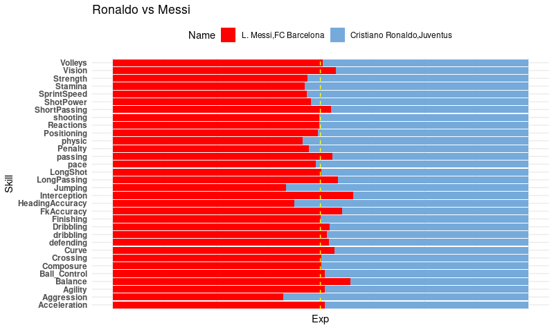

### La liga Native and foreign player
<details>
  <summary>Click to expand!</summary>
  
```r
L_NAT <- La_Liga %>% mutate(Nationality=as.character(nationality),
                   Nationality = if_else(nationality %in% "Spain","Native","Foreigner"))
                   
ggplot(L_NAT)+geom_bar(aes(x=Nationality,fill= Nationality),show.legend = F)+
  facet_wrap(club_name~.)+labs(title = "La Liga Native and Foreigner player")
```
</details>
  
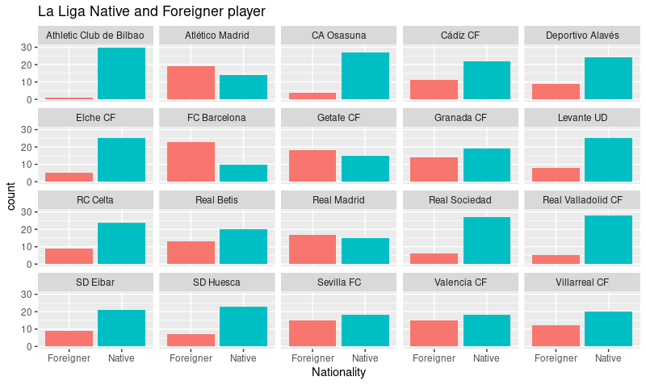

### EPL Native and foreign player
<details>
  <summary>Click to expand!</summary>
  
```r
EPL_NAT <- EPL %>% mutate(Nationality=as.character(nationality),
                            Nationality = if_else(nationality %in% "England","Native","Foreigner"))

ggplot(EPL_NAT)+geom_bar(aes(x=Nationality,fill= Nationality),show.legend = F)+
  facet_wrap(club_name~.)+labs(title = "EPL Native and Foreigner player")
```
</details>
  
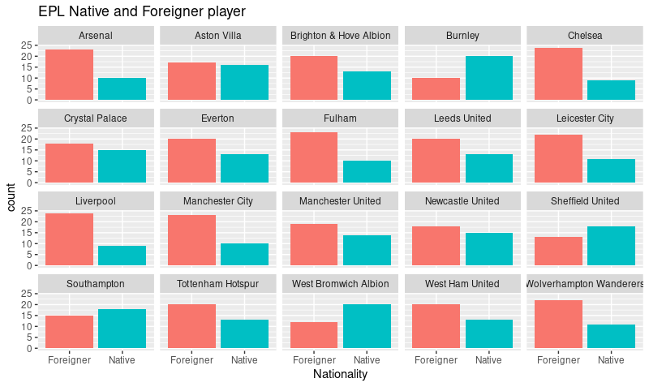

### Bundesliga Native and foreign player
<details>
  <summary>Click to expand!</summary>
  
```r
Bund_NAT <- Bundesliga %>% mutate(Nationality=as.character(nationality),
                            Nationality = if_else(nationality %in% "Germany","Native","Foreigner"))

ggplot(Bund_NAT)+geom_bar(aes(x=Nationality,fill= Nationality),show.legend = F)+
  facet_wrap(club_name~.,nrow = 3)+labs(title = "Bundesliga Native and Foreigner player")

```
</details>
  
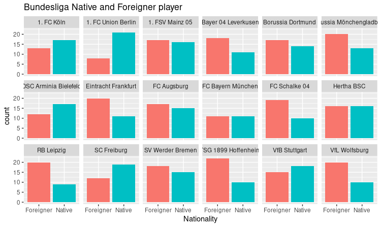

### Distribution of players in the whole Fifa data
<details>
  <summary>Click to expand!</summary>
  
```r
options(repr.plot.width = 15,repr.plot.height = 8)


f21 %>% drop_na(player_positionsb)%>%
  ggplot()+geom_bar(aes(x=player_positionsb,fill=player_positionsb),show.legend = F)+
  labs(title = "Player position distribution in the World")
```
</details>
  
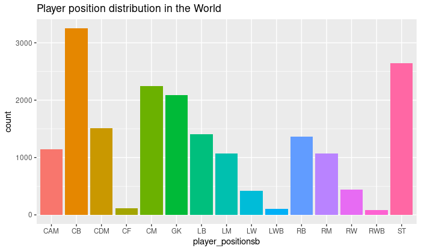

### Distribution in some top leagues
<details>
  <summary>Click to expand!</summary>
  
```r
options(repr.plot.width = 15,repr.plot.height = 8)


df %>% drop_na(player_positionsb)%>%
  ggplot()+geom_bar(aes(y=reorder(player_positionsb,player_positionsb, function(x) tapply(x,x,length)),fill=player_positionsb),show.legend = F)+
  facet_wrap(league_name~.,strip.position = "top")+
  labs(title="League wise Player position distribution")+xlab("Count")+ylab("Positions")

```
</details>
  
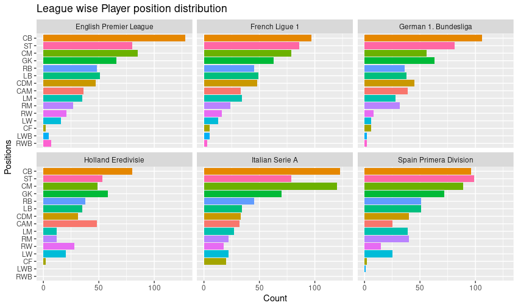

### Top 20
#### Forwards
<details>
  <summary>Click to expand!</summary>
  
```r
subset(fpos,Pos=="Forward") %>% arrange(desc(overall))%>%head(20)%>%
  ggplot(aes(x=overall,y=reorder(short_name,overall)))+geom_col(aes(fill=short_name),show.legend = F)+
  labs(x="Overall",y="Name",title = "Top 20 Forwards in the World")
```
</details>
  
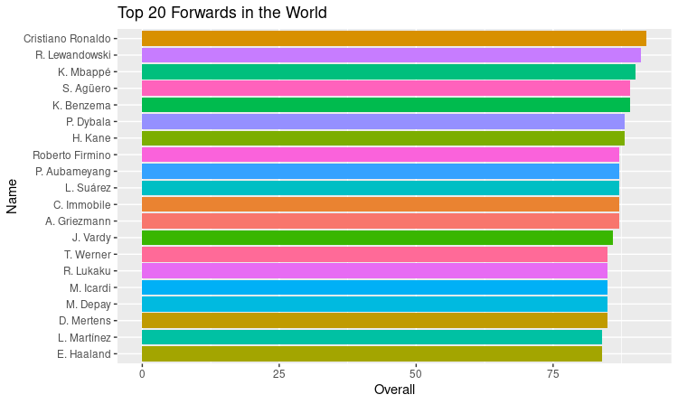
#### Wingers
<details>
  <summary>Click to expand!</summary>
  
```r
subset(fpos,Pos=="Winger") %>% arrange(desc(overall))%>%head(20)%>%
  ggplot(aes(x=overall,y=reorder(short_name,overall)))+geom_col(aes(fill=short_name),show.legend = F)+
  labs(x="Overall",y="Name",title = "Top 20 Wingers in the World")
```
</details>
  
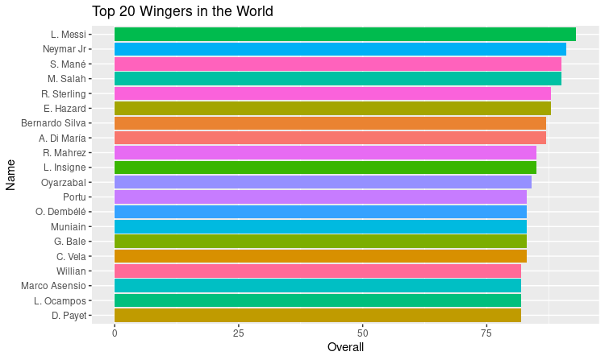
#### Midfielders
<details>
  <summary>Click to expand!</summary>
  
```r
subset(fpos,Pos=="Midfielder") %>% arrange(desc(overall))%>%head(20)%>%
  ggplot(aes(x=overall,y=reorder(short_name,overall)))+geom_col(aes(fill=short_name),show.legend = F)+
  labs(x="Overall",y="Name",title = "Top 20 Midfielders in the World")
```
</details>
  
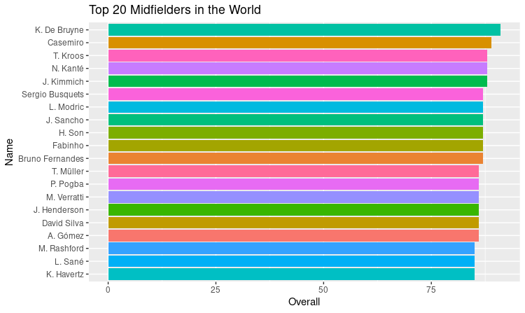
#### Defenders
<details>
  <summary>Click to expand!</summary>
  
```r
subset(fpos,Pos=="Defender") %>% arrange(desc(overall))%>%head(20)%>%
  ggplot(aes(x=overall,y=reorder(short_name,overall)))+geom_col(aes(fill=short_name),show.legend = F)+
  labs(x="Overall",y="Name",title = "Top 20 Defenders in the World")
```
</details>

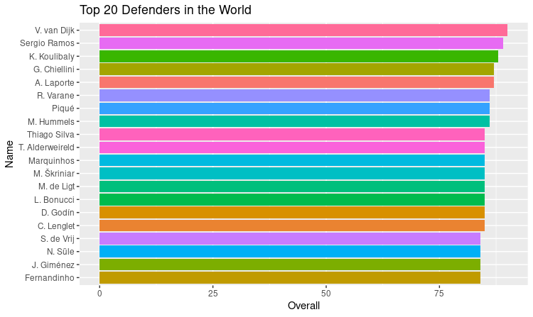
#### Full-Backs
<details>
  <summary>Click to expand!</summary>
  
```r
subset(fpos,Pos=="Full Back") %>% arrange(desc(overall))%>%head(20)%>%
  ggplot(aes(x=overall,y=reorder(short_name,overall)))+geom_col(aes(fill=short_name),show.legend = F)+
  labs(x="Overall",y="Name",title = "Top 20 Full Backs in the World")
```
</details>
  
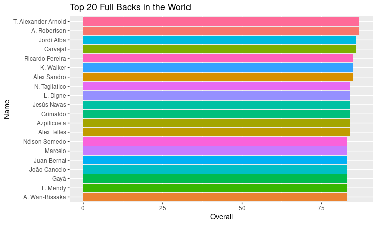
#### Goal Keepers
<details>
  <summary>Click to expand!</summary>
  
```r
subset(fpos,Pos=="Goal Keeper") %>% arrange(desc(overall))%>%head(20)%>%
  ggplot(aes(x=overall,y=reorder(short_name,overall)))+geom_col(aes(fill=short_name),show.legend = F)+
  labs(x="Overall",y="Name",title = "Top 20 Goal Keepers in the World")
```
</details>
  
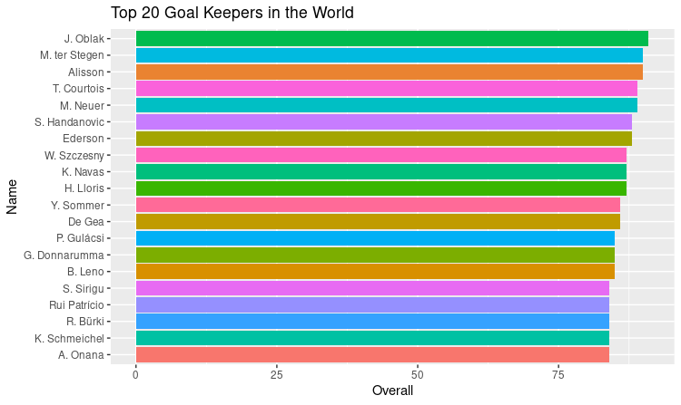


### Most Powerful Clubs
<details>
  <summary>Click to expand!</summary>
  
```r
fpos %>%
  group_by(club_name,Pos) %>%
  summarise(mean=mean(overall)) %>%
  ungroup() %>% 
  filter(club_name %in% powerful$club_name) %>%
  ggplot(aes(reorder(club_name,mean),mean,fill= Pos))+
  geom_col(position = "fill")+
  geom_text(aes(label = round(mean,digits = 2)),position = position_fill(0.5),size=3.5)+
  coord_flip()+
  theme_minimal()+
  theme(legend.position = "top",axis.text.y = element_text(face = "bold"),axis.text.x = element_blank())+
  labs(x="",y="",title = "Top 20 powerful clubs with their position class")
```
</details>
  
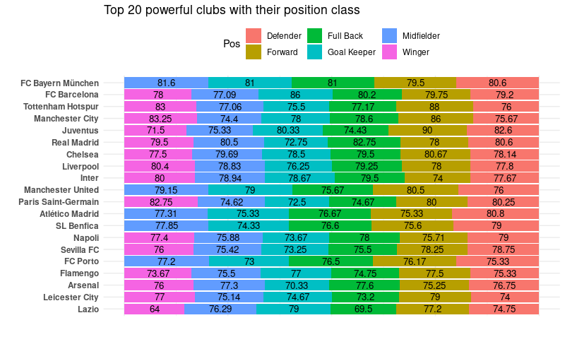

### Wonder Kids
<details>
  <summary>Click to expand!</summary>
  
```r
fpos %>% filter(age<20, potential>72) %>%
  arrange(-potential) %>%
  group_by(age)%>%
  do(head(.,10)) %>%
  ggplot(aes(reorder(paste0(paste(short_name,player_positionsb, sep = ", "),"(",club_name,
                            ")"),potential),potential,fill=as.factor(age)))+
  geom_col(show.legend = F)+
  coord_flip()+
  facet_wrap(age~.,scales = "free")+
  labs(x="",y="Potential",title = "Age-wise Wonder-Kids",subtitle = "Amongst them some might become star")

```
</details>
  


### Most Expensive team possible(Using the given Data)
<details>
  <summary>Click to expand!</summary>
  
```r
d2 <- data.frame(   x=c(0, 0, 16.5, 100, 100,83.5), 
                    xend=c(16.5,16.5, 16.5, 83.5,83.5,83.5),
                    y=rep(c(13.68, 61.32, 13.68),2), 
                    yend=rep(c(13.68,61.32,61.32),2))

pp <- data.frame(   x=c(0,16.5,16.5,25,25,50,50,75,75,87.5),
                    y=c(37.5,13.68,61.32,0,75,18.75,56.25,0,75,37.5),
                    name=c("J. Oblak"," V. van Dijk","A. Laporte",
                           "T. Alexander-Arnold","A. Robertson",
                           "T. Kroos","F. de Jong",
                           "M. Salah","Neymar Jr",
                           "K. Mbapp?"))
p<- ggplot(dfpos)+
  xlim(0,100)+ylim(0,75)+
  geom_vline(xintercept = c(0,50,100), color="white") + 
  geom_segment(data = d2,aes(x=x, xend=xend, y=y,yend=yend), color="white") +
  geom_point(aes(x=50,y=75/2), size=2, color="white") +
  geom_point(data=pp,aes(x=x,y=y), size=7, color="orange")+
  geom_text(data=pp,aes(x=x,y=y,label = name),size=5)+
  theme(panel.background = element_rect(fill = "darkgreen"),
        panel.grid = element_line(colour = "darkgreen"))+
  labs(title = "Most Expensive team possible in Fifa 21",subtitle = "With most recent player valuation")+
  xlab("")+ylab("")
p
```
</details>
  
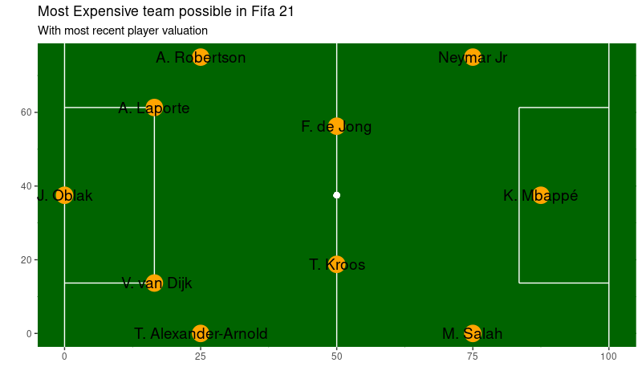
